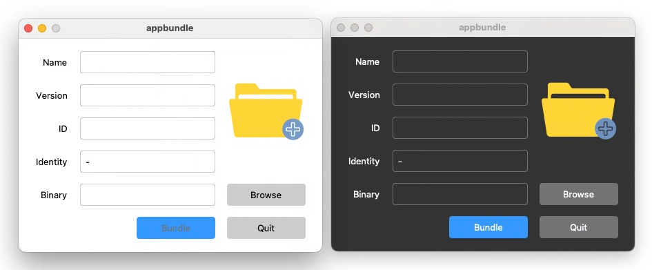

# appbundle

Command appbundle creates [MacOS Application_bundles].

## Installation

     $ go install modernc.org/tk9.0/appbundle@latest

## Usage

     $ appbundle [-dark] [-name <app_name>] [-version <ver>] [-id <bundle_id>] [-sign <identity>] path-to-binary

If any of the above flags/arguments are missing appbundler will start a GUI
allowing to fill the options.

[MacOS Application_bundles]: https://en.wikipedia.org/wiki/Bundle_(macOS)#Application_bundles
